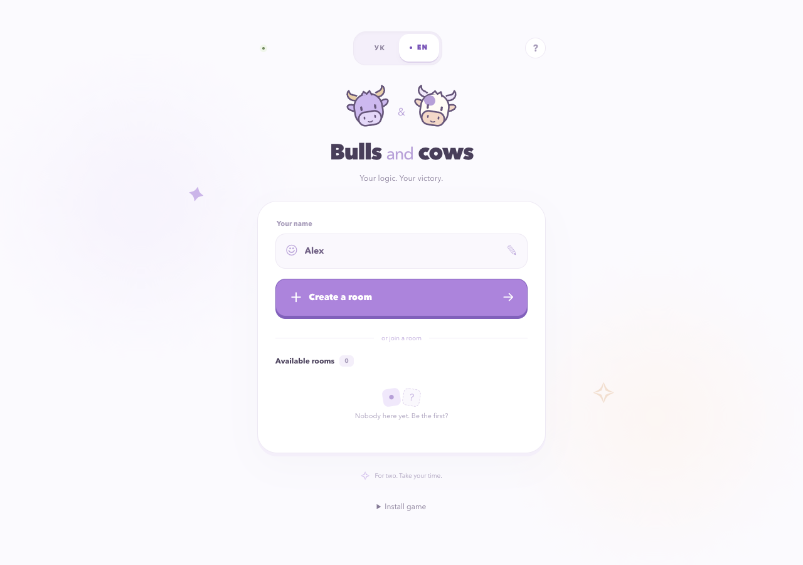

<div align="center">
  
  <h1>Bull & Cow</h1>
  <p>A real-time, two-player number guessing game built with TypeScript.</p>
  <p><a href="https://bull-and-cow.vercel.app/">Play the live demo</a> · <a href="#run-locally">Run locally</a> · <a href="docs/architecture.md">Architecture</a> · <a href="libs/ui/README.md">UI kit</a></p>
</div>




Each player chooses four distinct digits, then takes turns guessing the opponent’s code. A **bull** is a correct digit in the correct position; a **cow** is a correct digit in another position. Four bulls win the match. Leading zeroes are allowed.

To try it, open the demo in two browsers or invite a friend using a room link. No account is required.

## Features

- Live rooms, private secret selection, a shared countdown and turn-based play over WebSocket.
- Server-enforced 30-second turns, surrender, match results and mutually accepted rematches with a series score.
- Session recovery after a dropped connection or closed tab, with a 30-second reconnect window and paused turn timer.
- Ukrainian and English, responsive layouts, keyboard-friendly controls and reduced-motion support.
- An installable PWA with an offline fallback; multiplayer play still requires a connection.
- A reusable Storybook UI kit with isolated CSS Modules, semantic OKLCH design tokens and localized labels.

## Engineering highlights

| Concern | Implementation |
| --- | --- |
| Authoritative game state | The server validates turns, guesses, deadlines and match IDs. The client renders server snapshots. |
| Shared protocol | Zod schemas validate messages at runtime and provide TypeScript types for both ends of the connection. |
| Private player state | Room broadcasts exclude secrets and guess history. Each player receives a separate view of their match. |
| Durable recovery | Cloudflare stores room and session state in a SQLite-backed Durable Object. Alarms restore absolute deadlines after hibernation. |
| Portable game logic | Node.js and Cloudflare reuse game services with injected transport and timer implementations. |
| Component boundaries | UI components receive data, callbacks and labels through props; they do not depend on Next.js or the game connection. |

See [architecture and trade-offs](docs/architecture.md) for the request flow, persistence model and current limits.

## Stack and structure

**Next.js 16 · React 19 · TypeScript · Zod · Cloudflare Workers / Durable Objects · Node.js / ws · Storybook · Nx · pnpm**

```text
apps/
  web/                 Next.js frontend, game state, localization and PWA
  cloudflare-server/   Production Worker, durable storage and alarm scheduler
  websocket-server/    Shared game services and local Node.js WebSocket server
libs/
  shared/              Message schemas and protocol types
  ui/                  Components, design tokens and Storybook
  i18n/                Typed Ukrainian and English dictionaries
scripts/               Unit, integration and repository checks
.github/workflows/     CI and production Worker deployment
```

## Run locally

Prerequisites: **Node.js 22** and **pnpm 12.5.1** (the version pinned in `package.json`). No cloud account is required for local play.

```sh
pnpm install --frozen-lockfile
cp apps/web/.env.example apps/web/.env.local
```

Start the server and frontend in separate terminals:

```sh
# Terminal 1 — ws://localhost:3001
pnpm dev:server
```

```sh
# Terminal 2 — http://localhost:3100
pnpm dev:web
```

Open [localhost:3100](http://localhost:3100) in two browsers. The Node.js server keeps state in memory; restarting it clears rooms.

To use the Cloudflare runtime locally instead, set `NEXT_PUBLIC_WS_URL=ws://127.0.0.1:8787` in `.env.local`, run `pnpm dev:cloudflare` in place of `dev:server`, and restart the frontend. Wrangler persists local state separately from production.

## Quality checks

```sh
pnpm test                  # Game, sessions, Cloudflare runtime, UI boundaries, i18n and PWA
pnpm typecheck             # Frontend, UI kit and Cloudflare server
pnpm lint                  # Application and library lint checks
pnpm build:web             # Production frontend
pnpm build:cloudflare      # Worker bundle validation; does not deploy
pnpm storybook             # Component explorer on localhost:6006
pnpm build-storybook       # Static UI kit in dist/storybook/ui
```

Tests cover scoring, private snapshots, stale commands, turn expiry, reconnects, rematches, Durable Object hibernation and alarms. Integration tests start local servers and need permission to bind local ports. Storybook interaction examples and its accessibility panel are available for manual component review; they are not automated accessibility certification.

GitHub Actions runs checks on pull requests and pushes to `main`. The separate deployment workflow publishes the Worker after its backend checks pass. Vercel builds the frontend independently.

## Deployment and scope

The live frontend runs on **Vercel**; WebSocket connections go to **Cloudflare Workers and Durable Objects**. See [deployment instructions](DEPLOYMENT.md) for environment variables, API tokens and automated deployment.

This is a small multiplayer application, not a globally sharded game service. The production adapter currently uses one Durable Object, limited to **16 rooms and 64 connections**. There are no accounts, cross-device profiles, leaderboards or permanent match history. Browser session tokens support reconnects within the recovery window.

## Further reading

- [Architecture and trade-offs](docs/architecture.md)
- [Game lifecycle and recovery rules](docs/gameplay.md) — Ukrainian
- [Cloudflare adapter](apps/cloudflare-server/README.md) and [game services](apps/websocket-server/README.md)
- [UI kit](libs/ui/README.md), [localization](libs/i18n/README.md) and [protocol](libs/shared/README.md)
