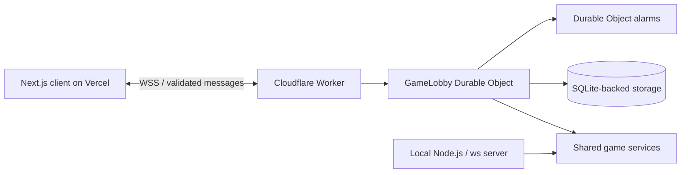

# Architecture

The application separates game rules, connection handling and rendering. Both server runtimes use the services in `apps/websocket-server/src`; the Cloudflare adapter does not maintain a second implementation of the rules.

## A player action

1. A UI component reports an intent through a callback. The frontend sends a typed protocol message.
2. The server validates its shape with Zod and checks session identity, room membership, match ID, turn ownership and deadline.
3. A game service changes authoritative state. The Cloudflare adapter processes expired deadlines before accepting a command.
4. Cloudflare persists the resulting state and next alarm before flushing queued responses.
5. Public room snapshots update the lobby. Private match snapshots update only the relevant player's board.

Secrets and opponent guesses are excluded from public snapshots. Both players can see readiness and attempt counts, but not each other's secret or guess history. Server-side secret storage is needed to score guesses and is cleared when the match ends.

## Recovery and timers

The browser keeps a session token in session storage, with a local storage fallback for reopening a closed tab. A new connection can resume that session; a takeover closes its previous connection. This is a browser-local identity, not an authenticated user account.

When the server detects a disconnect, it reserves the player's place for 30 seconds. An active turn pauses during recovery and resumes with its remaining time. If recovery expires, the other player wins. Each new round has a distinct match ID, so delayed commands from a previous round are rejected.

Game services depend on a timer interface. Node.js supplies regular timers. Cloudflare reconstructs callbacks from persisted absolute deadlines and schedules the next Durable Object alarm. Hibernation therefore does not restart a countdown or grant a fresh turn. Transport heartbeats use automatic WebSocket responses; alarms also check connection leases.

## Storage and scaling

The production Worker checks the request origin and routes WebSockets into one named `GameLobby` object. Storage records are split into session metadata and per-room state. Only changed records are written; empty rooms are removed.

One object provides straightforward ordering for a small public lobby, with limits of 16 rooms and 64 connections. Scaling requires a room directory and routing connections to separate objects. Renaming the current object would create a separate lobby rather than distribute the existing one.

The local Node.js server is intentionally in-memory. It supports the same game protocol, but does not preserve matches across process restarts. Durable state is recovery data, not permanent statistics or an event log.

## Frontend boundaries

- `apps/web` owns routing, the WebSocket connection, session storage and game orchestration.
- `libs/shared` owns the runtime protocol schemas and inferred types.
- `libs/ui` owns presentational components, their CSS Modules, stories and shared design tokens.
- `libs/i18n` owns dictionaries and language selection support. UI components receive translated labels through props.

The PWA service worker caches an offline screen and its resources. It does not cache room state, secrets or tokens, and does not force a reload during an active match.

## Delivery

Pull requests and pushes to `main` run CI. Worker deployment has its own backend checks and uses GitHub repository secrets. Vercel deploys independently; protocol changes must remain compatible while clients and servers run different versions. Deployments can interrupt sockets, so recovery still depends on the configured reconnect window.

Useful entry points: [protocol schemas](../libs/shared/src/lib/websocket.types.ts), [Node server](../apps/websocket-server/src/server.ts), [Cloudflare lobby](../apps/cloudflare-server/src/lobby.ts), [timer interface](../apps/websocket-server/src/time/timers.ts), [UI tokens](../libs/ui/src/styles/tokens.css).
